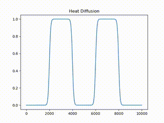

# Simulation Heat Equation (1 Dimension)

(**DRAFT**)

This is a simulation of the heat equation in one dimension.

<p align="center">
  
</p>

## Overview

The heat equation relates the change in temperature over time to changing differences in temperature at a distance. It expressed in the following way

$$
\frac{\partial u}{\partial t} = \alpha \frac{\partial^2 u}{\partial x^2}
$$

where $u(x, t)$ is a function describing the heat at position $x$ at time $t$ and $\alpha$ is the thermal diffusivity of the medium.

### Model

* $u(x)$ is heat at position $x$ in the "rod".
* $\alpha$ is the thermal diffusivity of the entire medium, which is constant.
* The domain of $u$ is split into $N$ bins, each corresponding to a range of uniformly sized intervals around $x$. E.g. if there are $N$ bins and the total "rod" length is 1 cm, then the $i^{\text{th}}$ index satisfies
  $\frac{1 \, \text{cm}}{N} \cdot i \le x_i < \frac{1 \, \text{cm}}{N} \cdot (i + 1)$.
* The values for $u(x)$ are stored in an array indexed by $i$.
* The endpoints of the rod are assumed to be a fixed heat of $0$.
* The small step in space is labeled $h$, but is named `dx` in the code.
* The small step in time is labeled $k$, but is named `dt` in the code.

### Simulation

The simulation implements a [](https://en.wikipedia.org/wiki/Finite_difference_method) utilizing the backward difference to calculate the numeric approximations of the evolving heat dispersion over time. This method was chosen for its known stability and well-behaved error term, $O(k + h^2)$.

## Setup

The following Python libraries are required to run the simulation:

```
pip install numpy scipy matplotlib
```

See [requirements.txt](./requirements.txt) for full Python dependency details.

Additionally, ffmpeg is required to render video files. You can get this on Debian with the following command:

```
apt-get install ffmpeg
```

## Running

To run the simulations, run the [simulate.py](./simulate.py) script with the demo you are interested in.

```
python3 simulate.py heat_diffusion
```

This one will generate `heat_diffusion.mp4` which you can then watch.

The following demos are available:

* `basic`
* `heat_diffusion`
* `heat_diffusion_silver`

## Development

Use GNU make to build the static assets presented in the repository:

```
make
```
